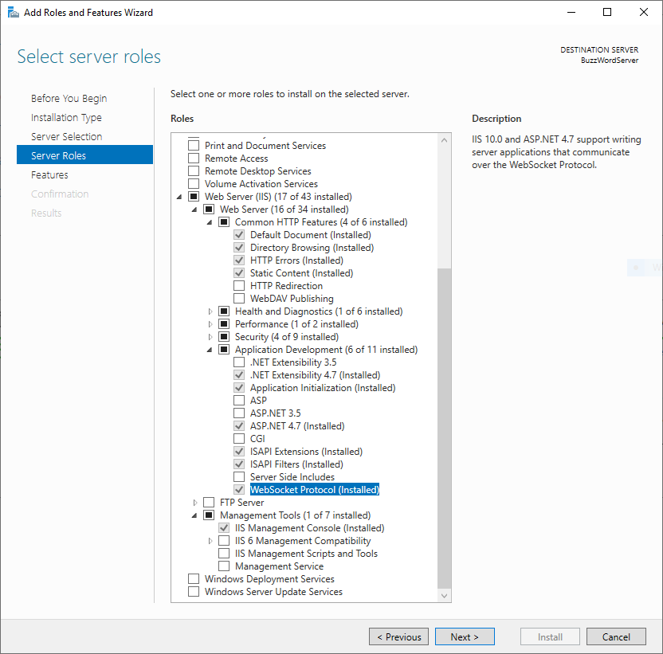
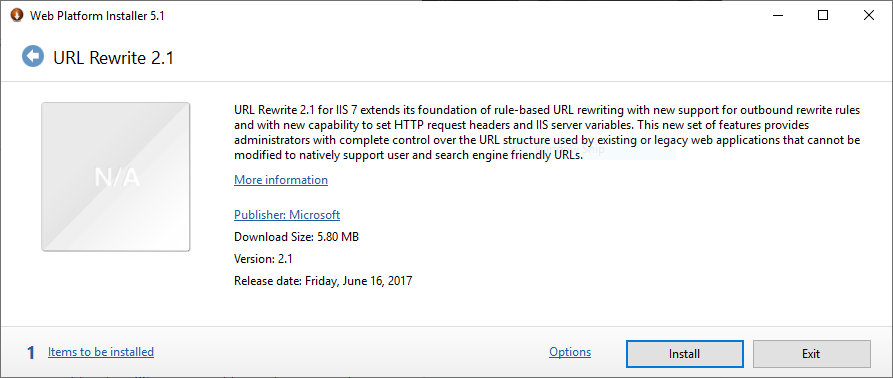

# IIS Deployment

Deploying Wayk Den behind IIS is possible with the URL Rewrite and Application Request Routing (ARR) modules. IIS is not necessarily the recommended deployment option for Wayk Den (https://containo.us/traefik/[traefik], https://www.nginx.com/[nginx] and http://www.haproxy.org/[haproxy] are worthy alternatives). However, if you are comfortable with IIS or if you need it to deploy additional applications that require IIS within the same server, then it should be a good choice.

## IIS Feature Installation

Open a PowerShell prompt and install the base IIS features required (IIS server + WebSocket support + management tools)

----
$Features = @(
    'Web-Server',
    'Web-WebSockets',
    'Web-Mgmt-Tools')

foreach ($Feature in $Features) {
    Install-WindowsFeature -Name $Feature
}
----

You can install additional features, but the most important not to forget is the WebSocket protocol support:

As for the IIS graphical management tools, they are recommended but not required, and they are absent from Windows Server Core.

## IIS Module Installation

The two IIS modules we need (URL Rewrite and Application Request Routing) are not available as IIS features, and need to be installed using the https://www.microsoft.com/web/downloads/platform.aspx[Web Platform Installer].

Once you have the Web Platform Installer, install (in order) the URL Rewrite and the Application Request Routing modules:

https://www.iis.net/downloads/microsoft/url-rewrite[IIS URL Rewrite Module]

https://www.iis.net/downloads/microsoft/application-request-routing[IIS Application Request Routing Module]

image::images/iis_arr_module.png[IIS ARR Module]

Alternatively, you can install the modules using https://chocolatey.org/install[chocolatey]:

----
choco install urlrewrite -y
choco install iis-arr -y
----

However, the IIS URL Rewrite and Application Request Routing (ARR) modules are difficult to install automatically, so results may vary. The GUI installation is the most guaranteed to work.

## IIS Global Configuration

By default, IIS does not preserve the HTTP Host header when proxying requests, which breaks Wayk Den. The 'preserveHostHeader' setting in the 'system.webServer/proxy' section of the configuration needs to be set to 'true':

image::images/iis_preserve_host_header.png[IIS Preserve Host Header]

Alternatively, the same modification can be done at the command line:

----
%windir%\system32\inetsrv\appcmd.exe set config -section:system.webServer/proxy -preserveHostHeader:true /commit:apphost
----

## IIS Site Configuration

image::images/iis_https_site_binding.png[IIS HTTPS site binding]
